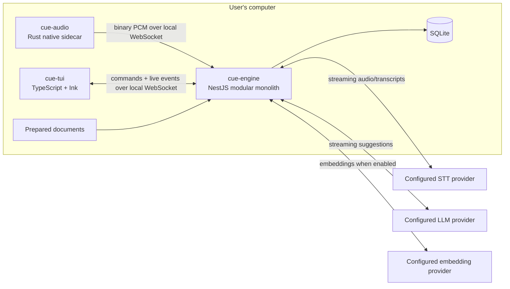
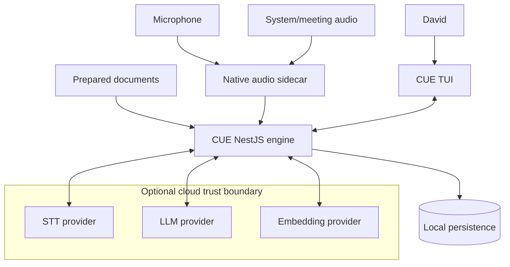
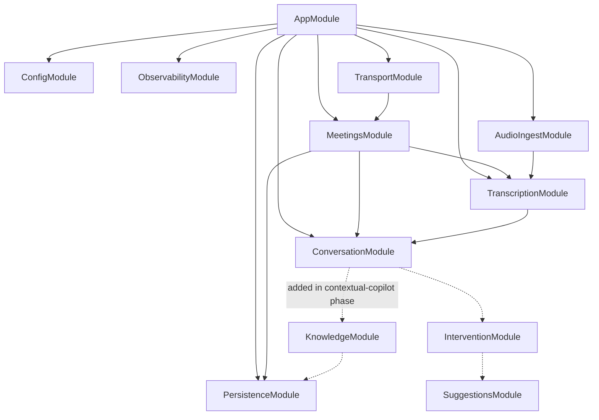
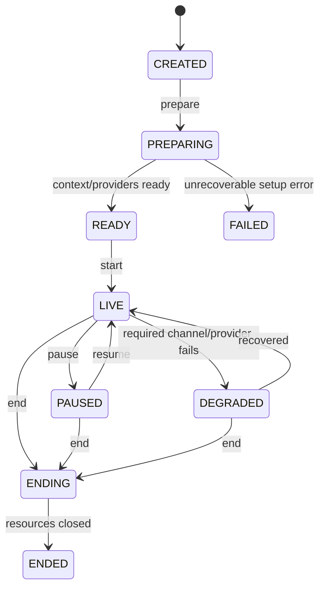
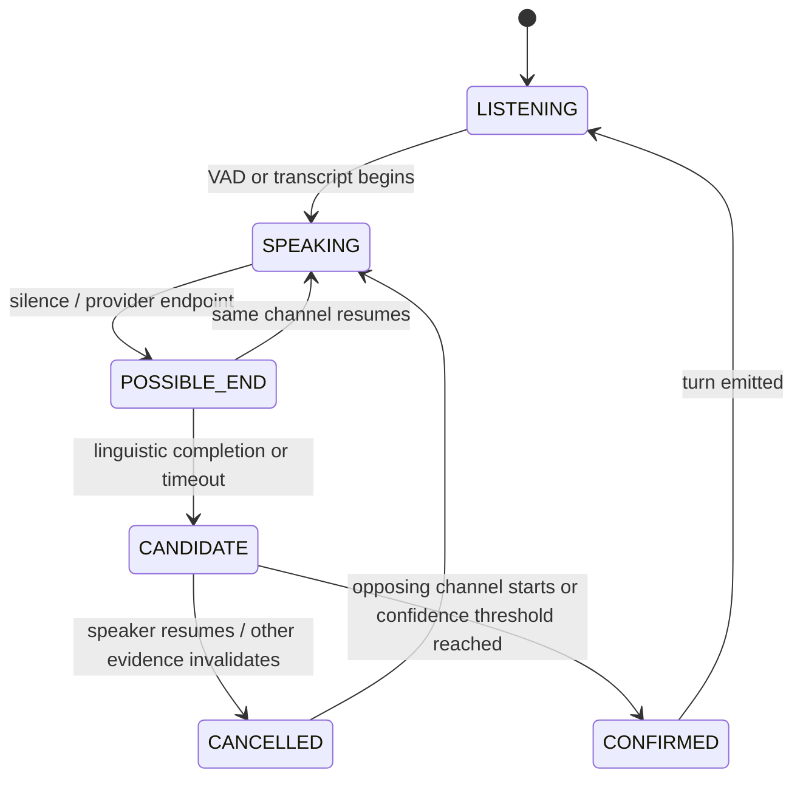

---
tags:
  - project/cue
  - architecture
  - nestjs
  - real-time
status: proposed
created: 2026-08-12
updated: 2026-08-12
source: '[[CUE-specification]]'
---

# CUE — [[Architecture]]

> [!abstract] Architecture decision
> Build CUE first as a **local modular monolith in NestJS**, with two deliberately small companion processes: a Rust native-audio sidecar and a TypeScript/Ink TUI. NestJS owns meeting orchestration, streaming transcription, conversation state, intervention decisions, retrieval, suggestions, persistence, and observability. Rust owns only native capabilities that Node cannot provide reliably. No message broker, microservices, Qdrant, or desktop shell is required for the first working vertical slice.

**[[STATUS]]:** Proposed foundation architecture  
**Scope:** From the first audio/transcription prototype through contextual live suggestions  
**Primary goal:** Build a useful real-time meeting copilot while learning the foundations of NestJS through real product [[Requirements]]  
**Product source:** [[CUE-specification]]

---

## 1. Executive decision

CUE will begin as three local processes in one monorepo:

1. **`cue-engine`** — a NestJS application listening only on localhost. It is the application brain and source of live meeting state.
2. **`cue-audio`** — a small Rust executable that captures microphone and system audio as separate streams and sends timestamped PCM frames to the engine.
3. **`cue-tui`** — an Ink/React terminal client that sends user commands and renders [[Notas de la reunión|transcript]], suggestions, state, and diagnostics.



This is a **distributed process model but not a distributed system**: everything product-owned runs on one machine, one NestJS instance owns application behavior, and no broker or network deployment is required.

### Why this shape

- It preserves the specification's engine/client separation.
- It makes the NestJS application substantial enough to teach the framework properly.
- It prevents native audio complexity from contaminating the TypeScript domain model.
- It allows a future desktop overlay to replace or accompany the TUI without rewriting the engine.
- It supports cloud providers now and local providers later through the same ports.
- It keeps failures isolated: transcription can continue if the TUI reconnects, and the transcript can continue if suggestion generation fails.

### Deliberate constraint

Do not split the NestJS engine into microservices during the early phases. Modules are boundaries; processes are deployment units. CUE needs good module boundaries now, not operational distribution.

---

## 2. Architecture principles

1. **NestJS is the learning surface.** Application behavior should live in explicit Nest modules and injectable providers.
2. **Native code earns its place.** Rust is limited to audio capture, OS permissions/device behavior, and later secure credential access if needed.
3. **Commands are direct; facts are events.** A request to start a meeting is a command. `TurnCompleted` is an event that something already happened.
4. **Streaming data is transient by default.** Audio frames and interim transcripts are not domain records.
5. **One source of live truth.** The engine owns meeting and pipeline state; the TUI renders a projection of it.
6. **User knowledge outranks model memory.** Suggestions must disclose whether prepared context was used and which chunks supported them.
7. **Silence is a result.** `do_not_intervene` is an explicit, observable decision.
8. **Latency is measured at boundaries.** Every stage receives correlation IDs and monotonic timestamps.
9. **Local-first is an architectural capability, not an MVP promise.** Provider boundaries must allow local implementations without requiring them in Phase 1.
10. **Infrastructure follows evidence.** No RabbitMQ, Kafka, Redis, or Qdrant until a measured requirement justifies it.

---

## 3. System context and trust boundaries



The UI must display the active data route before a meeting begins:

```text
Audio:       sent to Deepgram
Transcript:  sent to configured LLM when intervention is triggered
Documents:   processed locally; retrieved excerpts sent to LLM
Persistence: final transcript enabled; raw audio disabled
```

If a provider is local, the same screen should say so explicitly.

---

## 4. Process model

| Process               | Owns                                                                                                                                                             | Must not own                                                |
| --------------------- | ---------------------------------------------------------------------------------------------------------------------------------------------------------------- | ----------------------------------------------------------- |
| `cue-engine`          | Meeting lifecycle, WebSocket sessions, STT connections, transcript assembly, turn detection, intervention policy, retrieval, LLM streaming, persistence, metrics | OS-specific audio APIs, terminal rendering                  |
| `cue-audio`           | Device enumeration, permissions, microphone capture, system loopback capture, resampling, channel labels, bounded buffering                                      | STT, transcript logic, RAG, suggestions                     |
| `cue-tui`             | Keyboard input, presentation state, reconnect UX, transcript/suggestion/diagnostic rendering                                                                     | Canonical meeting state, provider calls, business decisions |
| Cloud/local providers | STT, LLM, or embeddings behind a port                                                                                                                            | Meeting orchestration                                       |

### Startup model

For development, run each process independently. For normal use, a thin `cue` launcher should:

1. choose a free localhost port;
2. create a random per-run session token;
3. start `cue-engine` bound to `127.0.0.1` only;
4. start `cue-audio` with the port and token passed through inherited process input, not a persisted file;
5. start `cue-tui` with the same connection information;
6. shut down children gracefully when the user exits.

The launcher is packaging glue, not a fourth architectural service.

### Local communication

Use **WebSocket over localhost** for Phase 1:

- `/audio` — sidecar control messages plus binary audio frames;
- `/client` — TUI commands and engine events;
- `/health` — simple HTTP readiness and provider-status endpoint.

Nest gateways are providers, so they participate in dependency injection and can use guards, pipes, filters, and interceptors. Nest officially supports both Socket.IO and `ws`; choose the lightweight `ws` adapter for CUE's local, controlled protocol ([NestJS gateways](https://docs.nestjs.com/websockets/gateways), [NestJS WebSocket adapter](https://docs.nestjs.com/websockets/adapter)).

Do not use gRPC initially: its schemas and tooling add value for multi-language service APIs, but the only high-rate payload here is simple framed PCM. Do not use stdin/stdout as the main protocol: it couples lifecycle and transport and makes future clients harder. Do not use SSE: CUE needs bidirectional commands and binary audio.

---

## 5. NestJS application [[Design]]

### 5.1 Module map



### 5.2 Initial modules

#### `TransportModule`

- `AudioGateway`: authenticates the sidecar, accepts audio stream metadata and PCM frames.
- `ClientGateway`: accepts TUI commands and broadcasts state/events.
- DTOs with runtime validation for every JSON message.
- A transport mapper converts wire DTOs into application commands; gateways contain no orchestration logic.

**NestJS lesson:** gateways, decorators, pipes, guards, exception filters, and transport/application separation.

#### `MeetingsModule`

- `MeetingApplicationService`: handles `StartMeeting`, `PauseMeeting`, `ResumeMeeting`, and `EndMeeting`.
- `MeetingSession`: explicit state machine and invariants.
- `MeetingProjectionService`: produces snapshots for newly connected clients.
- `MeetingRepository`: persists meeting metadata and final outcomes when enabled.

**NestJS lesson:** modules, controllers/gateways versus services, dependency injection, lifecycle hooks, and provider scope.

Keep the meeting service singleton. Do not use request-scoped providers for long-lived meeting state.

#### `AudioIngestModule`

- validates stream configuration;
- tracks sequence gaps and clock skew;
- records audio/VAD metrics;
- routes frames by `meetingId` and `channel`;
- never stores raw audio unless recording is explicitly enabled in a later phase.

**NestJS lesson:** injectable services, lifecycle cleanup, backpressure, and observable streams.

#### `TranscriptionModule`

- `SpeechToTextPort` injection token;
- `DeepgramSpeechToTextAdapter` as the first cloud adapter;
- later `LocalWhisperSpeechToTextAdapter`;
- one streaming STT session per logical audio channel unless the chosen provider proves a multichannel stream preserves the desired labels;
- `TranscriptAssembler` converts provider-specific interim/final messages into stable CUE events.

**NestJS lesson:** custom providers and dependency inversion. TypeScript interfaces disappear at runtime, so use exported `Symbol` tokens or abstract classes as DI tokens, as described in the official [custom providers documentation](https://docs.nestjs.com/fundamentals/custom-providers).

#### `ConversationModule`

- owns the recent transcript window;
- maintains independent local and remote speech activity;
- implements the turn state machine;
- emits candidate and confirmed turn events;
- later maintains topic and conversational-summary projections.

**NestJS lesson:** stateful singleton providers, domain state machines, typed in-process events, and deterministic testing with a fake clock.

#### `PersistenceModule`

- owns the SQLite connection and schema migrations;
- exports repositories, not the raw database, to feature modules;
- queues small batched writes so transcript persistence does not block the hot path.

**NestJS lesson:** provider factories, module exports, repositories, application shutdown, and integration testing.

#### Later modules

- `KnowledgeModule`: document ingestion, chunking, embeddings, indexing, retrieval.
- `InterventionModule`: deterministic gates plus scored intervention policy.
- `SuggestionsModule`: prompt construction, LLM streaming, cancellation, citations.
- `ProvidersModule`: dynamic configuration only when multiple provider families actually exist.

Do not build a generic “AI module” that hides all these responsibilities.

### 5.3 Provider pattern

Use ports only at volatile external boundaries:

```ts
export const SPEECH_TO_TEXT = Symbol('SPEECH_TO_TEXT');

export interface SpeechToTextPort {
  open(input: SttSessionInput): Promise<SpeechToTextSession>;
}
```

Register the initial implementation in the module:

```ts
{
  provide: SPEECH_TO_TEXT,
  useClass: DeepgramSpeechToTextAdapter,
}
```

Good ports:

- `SpeechToTextPort`
- `LanguageModelPort`
- `EmbeddingPort`
- `KnowledgeIndexPort`
- `MeetingRepository`
- `Clock`

Avoid interfaces around every internal service. The goal is to learn NestJS DI, not manufacture ceremony.

### 5.4 Internal event mechanism

Use a typed, in-process event bus provider. It may wrap RxJS Subjects or a small event emitter, but feature code should publish and subscribe through one CUE-owned contract.

Rules:

- commands call application services directly;
- domain/application events describe completed facts;
- event handlers must be fast or explicitly schedule work;
- handlers in the live path are non-durable;
- important state is reconstructed from the meeting aggregate and final transcript, not from replaying every audio event;
- an event name is past tense: `MeetingStarted`, `TranscriptFinalized`, `TurnConfirmed`, `InterventionSuppressed`.

Do not introduce Nest CQRS in the first phases. It can be evaluated later if command/query handling becomes genuinely complex.

---

## 6. Audio architecture

### 6.1 Capture decision

Use Rust with `cpal` as the common audio abstraction. CPAL currently exposes WASAPI on Windows and CoreAudio on macOS; its recent releases also report CoreAudio loopback support on macOS versions newer than 14.6 ([CPAL repository](https://github.com/RustAudio/cpal)). Treat macOS system capture as a required spike, not an assumption, because OS version, permissions, and device behavior still need real-machine validation.

Platform approach:

| Platform                  | Microphone          | System audio                                                     | Decision                      |
| ------------------------- | ------------------- | ---------------------------------------------------------------- | ----------------------------- |
| Windows                   | CPAL/WASAPI capture | WASAPI loopback through CPAL; direct WASAPI fallback if required | Primary implementation target |
| macOS 14.6+               | CPAL/CoreAudio      | Test CPAL CoreAudio loopback first                               | Preferred common path         |
| Older/special macOS cases | CPAL/CoreAudio      | ScreenCaptureKit-specific adapter                                | Compatibility fallback        |

Microsoft documents WASAPI loopback as capture from a render endpoint using shared-mode loopback, which makes it the appropriate Windows primitive ([Microsoft WASAPI loopback](https://learn.microsoft.com/en-us/windows/win32/coreaudio/loopback-recording)). Apple ScreenCaptureKit remains the fallback for macOS system audio and requires the relevant system capture permission ([Apple ScreenCaptureKit](https://developer.apple.com/documentation/screencapturekit/capturing-screen-content-in-macos)).

Expose one Rust trait:

```text
AudioCapture
├── list_devices()
├── request_permissions()
├── start(channel, device, format)
├── stop(channel)
└── subscribe_frames()
```

Implement platform-specific details behind it. Do not force the microphone and loopback streams into one physical device abstraction if the OS APIs behave differently; normalize only their output contract.

### 6.2 Canonical audio format

Initial wire format:

- PCM signed 16-bit little-endian;
- mono;
- 16 kHz;
- 20 ms capture frames;
- 320 samples / 640 bytes per frame;
- frames may be aggregated into 80–100 ms WebSocket payloads after timestamping;
- independent `YOU` and `THEM` streams.

This format matches common streaming STT inputs and keeps bandwidth small. Resample in the Rust sidecar so the engine and adapters receive one format.

### 6.3 Binary frame

Use a compact fixed header followed by PCM bytes:

```text
version       u8
channel       u8      # 1=YOU, 2=THEM
flags         u16
sequence      u64
capturedAtUs  u64     # monotonic time from sidecar session start
sampleRate    u32
sampleCount   u16
payload       bytes
```

The sidecar first sends a JSON `audio.stream.opened` message containing `meetingId`, `streamId`, device metadata, and time-origin information. Binary packets then refer to that authenticated connection and stream.

### 6.4 Backpressure

Each channel gets a bounded ring buffer, initially 2 seconds. The audio callback must never block on networking or logging.

If downstream sending falls behind:

1. record queue depth;
2. drop the oldest unsent audio frames once the bound is exceeded;
3. increment `audio_frames_dropped_total`;
4. send an `audio.gap` control message with the missing sequence range;
5. display degraded status in diagnostics.

Dropping recent conversational continuity is bad; blocking an OS audio callback until the entire capture pipeline fails is worse. The exact buffer length must be tuned from measurements.

---

## 7. Streaming transcription

### First provider

Use Deepgram streaming STT for the first cloud prototype because it exposes interim results, finalized segments, word timestamps, confidence, VAD events, and configurable endpointing over a live WebSocket. Its documentation explicitly distinguishes `is_final` from `speech_final` and requires concatenating finalized segments to reconstruct a complete utterance ([Deepgram endpointing and interim results](https://developers.deepgram.com/docs/understand-endpointing-interim-results)).

This is an initial validation choice, not permanent vendor selection.

### Session layout

- Open one STT connection for `YOU` and one for `THEM`.
- Tag every normalized result with CUE's `meetingId`, `streamId`, `channel`, and sequence-derived timing.
- Preserve provider word timestamps but convert provider fields into CUE contracts immediately.
- Render interim text but never persist it as canonical transcript.
- Append each provider-final segment to the active utterance.
- Treat provider endpointing as one signal, not as the domain's final turn decision.

### Normalized events

```ts
type TranscriptInterim = {
  type: 'transcript.interim';
  eventId: string;
  meetingId: string;
  streamId: string;
  channel: 'YOU' | 'THEM';
  revision: number;
  text: string;
  audioStartMs: number;
  audioEndMs: number;
  observedAt: string;
};

type TranscriptFinalized = {
  type: 'transcript.finalized';
  eventId: string;
  meetingId: string;
  segmentId: string;
  channel: 'YOU' | 'THEM';
  text: string;
  words: WordTiming[];
  confidence?: number;
  providerSpeechFinal: boolean;
  audioStartMs: number;
  audioEndMs: number;
  observedAt: string;
};
```

### Reconnection

- Audio sidecar reconnect: send stream metadata again and continue with monotonically increasing sequence numbers; the engine emits a gap if frames were lost.
- TUI reconnect: request a full current-state snapshot followed by events newer than `lastEventSequence`.
- STT reconnect: open a new provider stream, mark a transcript discontinuity, and continue. Do not pretend the missing interval is complete.
- No attempt should replay several seconds of buffered audio until the basic live pipeline is reliable; bounded replay can be evaluated later.

---

## 8. Meeting and conversation state

### 8.1 Meeting lifecycle



Invariants:

- only one live meeting per engine instance in the first version;
- `start` requires at least one usable audio channel and configured STT;
- ending is idempotent;
- suggestion work is cancelled when a meeting ends;
- degradation is visible and does not automatically discard the meeting.

### 8.2 Turn state machine

Track the two channels independently but decide turns using both:



### Minimum viable detector

The first detector is deterministic:

- provider VAD/speech-final signal;
- silence duration;
- whether the other channel starts speaking;
- punctuation/question marker from the finalized transcript;
- unfinished-clause heuristics;
- maximum turn duration safety bound.

Suggested initial thresholds to tune, not hard-code as product truth:

- `possibleEndAfterMs`: 350;
- `confirmQuestionAfterMs`: 550;
- `confirmStatementAfterMs`: 800;
- `forceEndAfterSilenceMs`: 1,400.

Inject a `Clock` and store thresholds in typed configuration so tests can advance time without sleeping.

### Speculation and cancellation

When a remote turn enters `CANDIDATE`:

1. increment `turnRevision`;
2. build a provisional query from current finalized plus interim text;
3. begin retrieval if the text is meaningful;
4. attach an `AbortController` to retrieval/generation work;
5. cancel the work if the speaker resumes or the revision changes;
6. publish a suggestion only for the current confirmed revision.

Every suggestion carries `basedOnTurnId` and `turnRevision`. The TUI discards any suggestion whose basis is no longer current, even if a provider returns late.

---

## 9. Intervention policy

Do not begin with an LLM call whose only job is deciding whether to call another LLM. Start with explainable gates and scores.

### Hard suppression gates

Return `do_not_intervene` when any is true:

- the local user is currently speaking;
- the meeting is paused, ending, or degraded beyond the required capability;
- the candidate turn is too short or contains no meaningful content;
- a suggestion for the same turn/revision already exists;
- the most recent suggestion is still fresh and the topic has not changed;
- retrieval and generation cannot finish before the freshness deadline;
- the remote speaker immediately continues.

### Initial score

```text
score =
  + direct_question          0.35
  + challenge_or_objection  0.20
  + decision_point          0.15
  + knowledge_match         0.20
  + explicit_user_request   0.50
  + extended_pause          0.10
  - local_user_speaking     1.00
  - recent_suggestion       0.25
  - low_turn_confidence     0.20
```

Surface automatically at an initially conservative threshold such as `0.65`. Always allow the user to press `S` to force a suggestion and `R` to force retrieval.

Persist the **reason codes and score**, not hidden chain-of-thought:

```ts
type InterventionDecision = {
  decision: 'SURFACE' | 'SUPPRESS';
  score: number;
  reasonCodes: InterventionReason[];
  turnId: string;
  expiresAt: string;
};
```

### Freshness

A suggestion becomes stale when:

- the user begins a response;
- the remote speaker begins a new substantial turn;
- the topic revision changes;
- the meeting pauses or ends;
- its deadline expires, initially 4 seconds after confirmation.

Stale suggestions are cancelled if still generating and visually retired if already rendered.

---

## 10. Knowledge and retrieval

### 10.1 First retrieval phase

Do not introduce Qdrant immediately. Meeting workspaces will initially contain a small prepared corpus. Use:

1. pre-meeting parsing and chunking;
2. embeddings computed once;
3. chunk metadata and vectors stored locally;
4. brute-force cosine similarity in process for up to an evidence-based threshold, initially 10,000 chunks;
5. lexical fallback for exact technical terms.

This keeps the first RAG implementation observable and teaches NestJS providers without adding another service.

Introduce a Qdrant adapter only when measurements show one of these needs:

- corpora exceed the comfortable in-process scan threshold;
- global plus meeting-specific knowledge needs filtered semantic search;
- [[index]] updates and query concurrency cause visible latency;
- a separately managed index is useful for multiple clients or engines.

The `KnowledgeIndexPort` makes this an adapter change rather than an application rewrite.

### 10.2 Ingestion flow

```text
Select meeting workspace
  -> discover allowed files
  -> parse to normalized text
  -> preserve source path + page/section metadata
  -> chunk by structure, then size
  -> hash chunks
  -> embed only new/changed chunks
  -> index under meetingWorkspaceId
  -> mark workspace READY
```

Supported order: Markdown and text first, PDF second, DOCX third. Each new parser must have fixture tests.

### 10.3 Live query composition

```text
remote turn (highest weight)
+ previous turn
+ current topic label
+ meeting goal
+ user's prepared position
+ compact rolling summary
```

Retrieve from the selected meeting workspace first. Search global knowledge only when explicitly enabled, and label results by scope.

Each retrieved chunk includes:

- `chunkId`;
- `documentId` and source path;
- section/page locator;
- text;
- semantic and lexical scores;
- workspace scope;
- content hash.

The suggestion contract includes the supporting `chunkId` values so the TUI can show provenance.

---

## 11. Suggestion generation

`SuggestionsModule` owns:

- `LanguageModelPort`;
- prompt assembly;
- provider streaming;
- cancellation and timeouts;
- output validation;
- suggestion revision and expiry;
- provenance mapping.

Suggested response contract:

```ts
type Suggestion = {
  suggestionId: string;
  meetingId: string;
  basedOnTurnId: string;
  turnRevision: number;
  status: 'STREAMING' | 'READY' | 'STALE' | 'FAILED';
  response: string;
  supportingPoints: string[];
  sourceChunkIds: string[];
  grounded: boolean;
  createdAt: string;
  expiresAt: string;
};
```

Stream the response to the TUI, but optimize for the first useful sentence rather than a long answer. The model instruction should cap the suggested response and separate it from optional supporting points.

If no prepared source supports a factual response:

- either suppress;
- or mark the output `grounded: false` and visibly label it “general model knowledge.”

Never imply that a generic answer came from the user's prepared material.

---

## 12. Domain, command, and event model

### Commands

| Command                          | Handler                        | Result                                                                          |
| -------------------------------- | ------------------------------ | ------------------------------------------------------------------------------- |
| `CreateMeetingWorkspace`         | `MeetingWorkspaceService`      | Workspace created                                                               |
| `AddKnowledgeSource`             | `KnowledgeIngestionService`    | Source scheduled/processed                                                      |
| `PrepareMeeting`                 | `MeetingApplicationService`    | Providers and knowledge become ready                                            |
| `StartMeeting`                   | `MeetingApplicationService`    | Live session starts                                                             |
| `PauseMeeting` / `ResumeMeeting` | `MeetingApplicationService`    | Processing state changes                                                        |
| `EndMeeting`                     | `MeetingApplicationService`    | Resources close and finals persist                                              |
| `ForceRetrieval`                 | `InterventionService`          | Retrieval result shown                                                          |
| `ForceSuggestion`                | `SuggestionApplicationService` | Suggestion starts regardless of automatic score, subject to safety/state checks |
| `ChangeProvider`                 | Provider configuration service | Applied between sessions initially                                              |

### Internal events

| Event                       |                                   Durable? | Main consumers                 |
| --------------------------- | -----------------------------------------: | ------------------------------ |
| `MeetingStarted`            |                                        Yes | Projection, persistence, TUI   |
| `AudioStreamOpened`         |                                         No | Transcription, metrics         |
| `AudioGapDetected`          |                       Metric/event summary | Diagnostics                    |
| `TranscriptInterimObserved` |                                         No | TUI, turn detector             |
| `TranscriptFinalized`       | Yes when transcript persistence is enabled | Conversation, persistence, TUI |
| `TurnCandidateDetected`     |                                         No | Speculative retrieval          |
| `TurnCandidateCancelled`    |                                         No | Cancellation, diagnostics      |
| `TurnConfirmed`             |                    Optional derived record | Intervention policy, TUI       |
| `KnowledgeRetrieved`        |         Diagnostic summary only by default | Intervention/suggestions, TUI  |
| `InterventionSuppressed`    |                     Metrics/reason summary | Diagnostics                    |
| `SuggestionDeltaReceived`   |                                         No | TUI                            |
| `SuggestionCompleted`       |                               Configurable | TUI, persistence               |
| `SuggestionBecameStale`     |                                         No | TUI                            |
| `MeetingEnded`              |                                        Yes | Cleanup, persistence, TUI      |

### Persisted entities

- `MeetingWorkspace`
- `KnowledgeDocument`
- `KnowledgeChunk` and its current embedding reference
- `Meeting`
- final `TranscriptSegment`
- `Suggestion` only when explicitly enabled
- provider/configuration metadata without secrets

### Transient state

- raw PCM frames;
- interim transcripts;
- audio levels;
- current VAD state;
- candidate turns;
- speculative retrieval results;
- streaming suggestion deltas;
- cancellation handles;
- raw prompts/responses unless debug capture is explicitly enabled.

---

## 13. Wire protocol rules

All JSON envelopes use a versioned discriminated union:

```ts
type Envelope<TType extends string, TPayload> = {
  protocolVersion: 1;
  type: TType;
  eventId: string;
  sequence: number;
  meetingId?: string;
  correlationId: string;
  causationId?: string;
  sentAt: string;
  payload: TPayload;
};
```

Rules:

- validate every incoming JSON message at runtime;
- close unauthorized or incompatible connections with explicit codes;
- sequences are monotonic per engine session;
- events may be duplicated after reconnect, so clients deduplicate by `eventId`;
- commands include a client-generated idempotency key;
- binary audio has its own compact frame format;
- protocol contracts live in a shared TypeScript package, while Rust maintains equivalent serde structs and cross-language fixture tests.

---

## 14. Persistence

Use **SQLite** because CUE is a single-user local application and needs simple, inspectable persistence.

Initial implementation:

- one database per user installation;
- WAL mode;
- [[Extract & Save Memory|schema]] migrations committed to the repository;
- explicit repositories behind Nest providers;
- batched transcript inserts off the hot audio callback path;
- no raw audio persistence by default;
- configurable final-transcript retention;
- deletion removes meeting records and meeting-scoped indexes.

For the learning-focused first implementation, use a small explicit SQLite adapter rather than introducing a large ORM abstraction before the data model exists. Reassess an ORM after the schema gains real complexity.

The source document remains the source of truth; the retrieval index is disposable and rebuildable.

---

## 15. Observability and latency

### Correlation model

Carry these IDs through the pipeline:

```text
meetingId
streamId
audio sequence range
segmentId
turnId + turnRevision
retrievalId
suggestionId
correlationId
```

Use structured logs. Content fields are redacted by default; IDs, durations, state transitions, byte counts, and reason codes remain available.

### Initial latency budget

Budgets begin at the end of a relevant remote turn:

| Stage                                 | Prototype target |   Later target | Measurement                        |
| ------------------------------------- | ---------------: | -------------: | ---------------------------------- |
| Capture aggregation + local transport |     p95 ≤ 120 ms |    p95 ≤ 80 ms | capture timestamp → engine receipt |
| STT interim arrival while speaking    |     p95 ≤ 500 ms |   p95 ≤ 300 ms | audio end → interim observed       |
| Turn confirmation after actual end    |     p95 ≤ 900 ms |   p95 ≤ 600 ms | last speech → `TurnConfirmed`      |
| Retrieval                             |     p95 ≤ 250 ms |   p95 ≤ 120 ms | query start → ranked chunks        |
| LLM time to first useful token        |   p95 ≤ 1,200 ms |   p95 ≤ 700 ms | request → first rendered content   |
| TUI rendering                         |      p95 ≤ 33 ms |    p95 ≤ 16 ms | event receipt → paint              |
| Perceived post-turn suggestion        |   p95 ≤ 2,500 ms | p95 ≤ 1,500 ms | actual turn end → useful text      |

These are engineering hypotheses. Record real percentiles by machine, provider, language, and network condition.

### Required metrics

- audio frames received/dropped and queue depth;
- STT connection state, interim/final latency, confidence;
- turn-state transitions and candidate cancellation rate;
- retrieval latency, candidate count, scores, selected chunk IDs;
- intervention scores and reason codes;
- LLM TTFT, completion time, cancellation rate;
- suggestion age when displayed and stale-before-use rate;
- WebSocket reconnects and protocol errors.

The TUI diagnostic panel consumes the same projection as logs; it must not scrape text logs.

---

## 16. [[Security]] and privacy

### Local exposure

- bind the engine to `127.0.0.1`, never `0.0.0.0` by default;
- require a random per-run token for both WebSocket endpoints;
- reject unknown origins/clients where applicable;
- do not expose provider keys to the TUI or logs.

### Credentials

Development may read API keys from environment variables. Packaged builds should store them in the OS credential store:

- Windows Credential Manager;
- macOS Keychain.

The native sidecar or a later narrow native credential helper can retrieve a key and pass it to the engine in memory during startup. Never persist credentials in YAML, JSON, SQLite, or the meeting workspace.

### Content handling

- no recording by default;
- no raw prompt logging by default;
- transcript persistence is explicit and visible;
- show precisely which content leaves the machine for each provider mode;
- support delete/export for meetings and knowledge indexes;
- future local-only mode swaps provider adapters without changing application services.

Meeting recording laws and organizational policies vary. CUE should show a consent reminder and make the user responsible for lawful use; it should not silently record.

---

## 17. Failure behavior

| Failure               | Engine behavior                                                            | TUI behavior                                  |
| --------------------- | -------------------------------------------------------------------------- | --------------------------------------------- |
| Microphone fails      | Continue `THEM` if available; mark degraded                                | Show `YOU unavailable`                        |
| System capture fails  | Continue `YOU`; disable automatic remote-turn assistance                   | Show clear blocking diagnostic                |
| STT connection fails  | Retry with bounded exponential backoff; preserve meeting state             | Keep UI alive and show transcript gap         |
| One STT channel fails | Continue other channel; suppress rules that require missing evidence       | Show channel-specific status                  |
| Retrieval fails       | Automatic policy may suppress or allow visibly ungrounded output by config | Mark “prepared context unavailable”           |
| LLM fails             | Transcription and retrieval continue                                       | Remove spinner, show concise error            |
| TUI disconnects       | Meeting continues; retain bounded event history and current projection     | Reconnect and request snapshot                |
| Engine restarts       | Active meeting ends in MVP; persisted finals remain                        | Explain that the live session was interrupted |
| High latency          | Cancel expired suggestion work                                             | Do not surface stale text                     |

Retries must be bounded and observable. Provider switching during a live session is postponed until restarting one provider can be made reliable.

---

## 18. Repository structure

Use a pnpm workspace plus a Rust workspace inside one repository:

```text
cue/
├── apps/
│   ├── engine/                       # NestJS application
│   │   ├── src/
│   │   │   ├── app.module.ts
│   │   │   ├── main.ts
│   │   │   ├── transport/
│   │   │   ├── meetings/
│   │   │   ├── audio-ingest/
│   │   │   ├── transcription/
│   │   │   ├── conversation/
│   │   │   ├── persistence/
│   │   │   ├── observability/
│   │   │   ├── knowledge/            # later
│   │   │   ├── intervention/         # later
│   │   │   └── suggestions/          # later
│   │   └── test/
│   ├── tui/                          # Ink/React client
│   │   ├── src/
│   │   │   ├── components/
│   │   │   ├── screens/
│   │   │   ├── state/
│   │   │   └── transport/
│   │   └── test/
│   └── launcher/                     # starts local processes
├── native/
│   └── audio/                        # Rust binary/library
│       ├── src/
│       │   ├── capture/
│       │   │   ├── windows.rs
│       │   │   └── macos.rs
│       │   ├── protocol/
│       │   ├── resample/
│       │   └── main.rs
│       └── tests/
├── packages/
│   ├── contracts/                    # DTOs/events, schemas, protocol fixtures
│   ├── config/                       # typed non-secret configuration
│   └── test-fixtures/                # WAVs and expected event timelines
├── docs/
│   ├── adr/
│   ├── benchmarks/
│   └── privacy/
├── tooling/
├── pnpm-workspace.yaml
├── Cargo.toml
└── [[README]].md
```

### Boundary rules

- `packages/contracts` contains no Nest imports and no application logic.
- feature modules do not import another module's internal files; they use exported providers/contracts.
- provider SDK response types stop at adapter boundaries.
- the TUI never imports engine services.
- Rust and TypeScript share protocol fixtures, not source code.
- tests can use recorded WAV fixtures; production code never depends on test assets.

Ink is selected because it provides React's component model and Flexbox-style terminal layout in TypeScript, keeping the first client approachable while NestJS remains the engine ([Ink repository](https://github.com/vadimdemedes/ink)). If high-refresh profiling later shows Ink is the bottleneck, retain the client protocol and replace only the TUI.

---

## 19. Testing strategy

### Test pyramid

1. **Unit tests** — services, state machines, policies, assemblers, query composition.
2. **Module integration tests** — Nest testing module with real providers and fake external ports.
3. **Contract tests** — JSON/binary fixtures shared between Rust and TypeScript.
4. **Recorded-audio pipeline tests** — deterministic WAV input replaces devices.
5. **End-to-end tests** — engine + fake audio sidecar + fake STT/LLM + TUI state reducer.
6. **Manual hardware matrix** — real Windows/macOS devices and permissions.

### Essential fakes

- `FakeClock`
- `FakeSpeechToTextAdapter`
- `FakeLanguageModelAdapter` with controllable token timing
- `FakeEmbeddingAdapter`
- `InMemoryKnowledgeIndex`
- `RecordedAudioSource`
- `CapturingEventSink`

### Reproducible meeting fixtures

Each fixture contains:

```text
meeting.wav or you.wav + them.wav
timeline.json              # speech intervals and channel labels
stt-results.json           # deterministic provider responses
expected-turns.json
expected-interventions.json
knowledge/                 # prepared documents
```

Benchmarks report:

- word error rate where a trusted transcript exists;
- turn precision/recall and end-time error;
- automatic intervention precision and suggestions per minute;
- retrieval recall@k for labeled questions;
- end-to-end p50/p95 latency;
- stale suggestion rate.

Do not use `setTimeout` sleeps in turn tests. Advance the fake clock and assert state transitions.

---

## 20. Phased implementation plan

Every phase must end with a runnable demonstration and a short learning note written by the developer.

### Phase 0 — NestJS walking skeleton

**Build**

- pnpm monorepo;
- NestJS engine with `ConfigModule`, `HealthModule`, and `TransportModule`;
- `ws` gateway with runtime-validated `ping` and `engine.snapshot` messages;
- minimal Ink TUI showing engine connection state;
- unit and one end-to-end test.

**Acceptance**

- `cue` starts the engine and TUI;
- TUI reconnects after engine restart in development;
- invalid messages produce a typed protocol error;
- clean shutdown leaves no child process.

**NestJS learning**

Bootstrap, modules, providers, DI, gateways, DTO validation, lifecycle hooks, and the testing module.

### Phase 1 — Deterministic streaming transcript simulator

**Build**

- `MeetingsModule`, `TranscriptionModule`, and `ConversationModule`;
- fake audio/STT adapter that replays a scripted dual-channel meeting;
- interim and final transcript assembly;
- TUI `YOU`/`THEM` transcript and diagnostic timing.

**Acceptance**

- scripted fixture streams in real time or accelerated time;
- interim revisions replace rather than duplicate text;
- final segments remain stable;
- a reconnecting TUI receives an accurate snapshot;
- tests cover meeting lifecycle and transcript assembly.

**NestJS learning**

Custom provider tokens, adapters, singleton state, module exports, event subscriptions, and fake dependencies.

### Phase 2 — Windows dual-channel audio

**Build**

- Rust sidecar;
- microphone plus WASAPI loopback;
- resampling and binary protocol;
- bounded buffers, sequence gaps, audio-level metrics;
- real Deepgram streaming adapter.

**Acceptance**

- Windows captures and labels both streams for a 30-minute session;
- no unbounded memory growth;
- device changes/failures are visible;
- transcript is usable in real time;
- p50/p95 stage latency is reported.

**NestJS learning**

Binary WebSocket ingestion, long-lived provider resources, cleanup, error filters, configuration factories, and observability.

### Phase 3 — macOS capture and turn detection

**Build**

- validate CPAL loopback on supported macOS;
- ScreenCaptureKit fallback if required;
- permissions UX;
- deterministic turn detector and TUI state display;
- recorded-fixture benchmark harness.

**Acceptance**

- supported macOS captures two labeled logical streams or clearly documents a tested OS limitation;
- turn precision/recall and boundary error are reported on fixtures;
- mid-sentence pauses do not routinely create confirmed turns;
- user speech cancels remote-turn speculation.

**NestJS learning**

State machines, configuration validation, scheduled timers through an injected clock, domain events, and cross-platform contract tests.

### Phase 4 — Prepared knowledge retrieval

**Build**

- Markdown/text ingestion;
- chunking, hashing, and embeddings;
- in-process vector index plus lexical matching;
- workspace readiness and source provenance;
- force-retrieve command and context panel.

**Acceptance**

- unchanged documents are not re-embedded;
- retrieval results show source and section;
- labeled test questions meet an agreed recall@k target;
- p95 retrieval stays within the prototype budget.

**NestJS learning**

Dynamic/factory providers, background work without a broker, repositories, module integration tests, and external SDK isolation.

### Phase 5 — Selective live suggestions

**Build**

- intervention gates and score;
- speculative retrieval;
- streaming LLM adapter;
- cancellation, expiry, and source-grounded suggestion contract;
- TUI suggestion and diagnostics panels.

**Acceptance**

- direct questions with relevant prepared knowledge produce a timely suggestion;
- ordinary statements do not create suggestion spam;
- local user speech cancels or stales pending output;
- TUI shows whether a suggestion is grounded and its sources;
- end-to-end p95 and stale-before-use rate are reported.

**NestJS learning**

Orchestration services, cancellation, interceptors, streaming responses, policy testing, and end-to-end composition.

### Phase 6 — Persistence, privacy, and provider substitution

**Build**

- SQLite repositories and migrations;
- retention/delete/export controls;
- OS credential storage;
- second STT or LLM adapter, preferably a local provider;
- provider disclosure screen.

**Acceptance**

- secrets are absent from files, DB, and logs;
- a meeting can run with two different provider configurations without changing application services;
- deletion removes meeting records and associated indexes;
- local/cloud data routes are visible before start.

**NestJS learning**

Persistence module design, asynchronous provider factories, integration testing, configuration composition, and graceful shutdown.

### Later — only after evidence

- PDF/DOCX ingestion;
- Qdrant adapter;
- local Whisper and local LLM;
- desktop overlay client;
- post-meeting analysis;
- durable jobs/message broker;
- multi-user or remote engine.

---

## 21. When event infrastructure becomes justified

### No broker through Phase 6

WebSockets and an in-process typed event bus are sufficient while:

- one engine owns one live meeting;
- all application modules run in one process;
- jobs are short or safely restartable;
- there is no durable background processing requirement.

### RabbitMQ becomes reasonable when

- post-meeting summarization/indexing must survive engine restarts;
- multiple independent workers consume the same meeting-completed event;
- retries and dead-letter handling are product requirements;
- CPU-heavy local inference runs outside the engine;
- workloads need independent concurrency limits.

### Kafka is not currently justified

CUE does not require long-lived replayable organization-wide event streams, high partition throughput, or many independent consumer groups. Introducing Kafka for learning would teach operations before it teaches the product problem.

If a broker is introduced, raw 20 ms audio frames should still not be published as durable business events. `MeetingEnded` is a domain event; `AudioFrameReceived` is transient stream data.

---

## 22. Decisions and rejected alternatives

| Topic             | Decision                               | Rejected/deferred                   | Reason                                                     |
| ----------------- | -------------------------------------- | ----------------------------------- | ---------------------------------------------------------- |
| Application shape | NestJS modular monolith                | Early microservices                 | Best learning-to-complexity ratio                          |
| Native audio      | Small Rust sidecar                     | Node native addons in the engine    | Isolates OS/audio failure and avoids ABI coupling          |
| TUI               | TypeScript + Ink                       | Rust `ratatui` initially            | Faster UI iteration and shared TS contracts; profile later |
| Local transport   | Raw WebSocket                          | Socket.IO, gRPC, stdin/stdout, SSE  | Bidirectional, binary-capable, future-client-friendly      |
| STT first         | Deepgram streaming adapter             | Local Whisper first, many providers | Validate latency loop before local inference complexity    |
| Turn detection    | Deterministic multimodal state machine | LLM-only classification             | Lower latency, cost, and easier testing                    |
| Retrieval first   | In-process vectors + lexical           | Qdrant immediately                  | Small prepared corpus does not justify a service           |
| Persistence       | SQLite                                 | Postgres                            | Single-user local product                                  |
| Events            | Typed in-process bus                   | RabbitMQ/Kafka/Nest CQRS            | No durability/distribution requirement yet                 |
| Desktop           | No Tauri initially                     | Copy NexQ's desktop stack           | TUI is the chosen first interface                          |
| Recording         | Off by default                         | Full audio archive                  | Privacy and non-goal for the first loop                    |

---

## 23. Risk register

| Risk                                            | Likelihood      | Impact   | Early mitigation                                                                | Evidence/exit condition                 |
| ----------------------------------------------- | --------------- | -------- | ------------------------------------------------------------------------------- | --------------------------------------- |
| Windows loopback/device variance                | Medium          | High     | Test multiple devices and long sessions; retain direct WASAPI escape hatch      | 30-minute stable matrix run             |
| macOS system-audio permissions/API variance     | High            | High     | Time-box CPAL spike; implement ScreenCaptureKit adapter if needed               | Tested supported OS matrix              |
| Echo causes duplicate `YOU`/`THEM` speech       | Medium          | High     | Headphones for baseline; channel energy/timing diagnostics; later echo handling | Duplicate-rate benchmark                |
| STT latency/accuracy varies by network/language | High            | High     | Provider adapter, fixtures, percentiles, configurable endpointing               | Measured p95 and WER                    |
| Pauses create false turns                       | High            | High     | Candidate/cancel state, opposing-channel signal, deterministic corpus           | Turn precision/recall target            |
| Suggestion arrives after user starts speaking   | High            | High     | Speculation, cancellation, freshness deadline                                   | Stale-before-use rate                   |
| Suggestion spam harms trust                     | Medium          | High     | Conservative gates, cooldown, force-suggest shortcut, reason metrics            | Suggestions/minute and precision review |
| Retrieved context is irrelevant                 | Medium          | High     | Meeting-first scope, hybrid retrieval, provenance, labeled queries              | Recall@k evaluation                     |
| Provider cost grows invisibly                   | Medium          | Medium   | Per-meeting usage metrics and configurable limits                               | Cost dashboard/test budget              |
| Sensitive data reaches cloud unexpectedly       | Low if designed | Critical | Pre-meeting disclosure, adapter data policies, local binding, redacted logs     | Privacy flow tests/review               |
| TUI rendering flickers or consumes CPU          | Medium          | Medium   | Render projections, throttle audio meters, profile Ink                          | Stable CPU/render percentile            |
| Too much architecture slows learning            | Medium          | High     | Phase gates; no optional infrastructure before acceptance criteria              | Runnable result each phase              |
| Provider SDK leaks across modules               | Medium          | Medium   | Normalize at adapters; architecture tests/import rules                          | No SDK types in domain/application code |

---

## 24. NexQ code-reading plan

NexQ currently reports Tauri 2, React/TypeScript, CPAL/WASAPI audio, multiple STT/LLM providers, local RAG, and SQLite, and its source tree separates native `audio`, `stt`, `llm`, `rag`, `intelligence`, `credentials`, and `db` areas ([NexQ repository](https://github.com/naxhq/NexQ), [native source tree](https://github.com/naxhq/NexQ/tree/main/src-tauri/src)). Read it phase by phase rather than front to back.

| CUE phase            | NexQ areas to inspect                                                                                        | Question                                                             | CUE disposition                                 |
| -------------------- | ------------------------------------------------------------------------------------------------------------ | -------------------------------------------------------------------- | ----------------------------------------------- |
| Audio spike          | `src-tauri/src/audio/`, audio-related commands, Cargo dependencies                                           | How are mic/system devices opened, resampled, buffered, and stopped? | Adapt concepts; do not inherit Tauri IPC        |
| Transcript streaming | `src-tauri/src/stt/`, `src/hooks/useSpeechRecognition.ts`, `useAudioTranscriptSync.ts`, `useStreamBuffer.ts` | How are partial/final results normalized and synchronized?           | Adapt event/revision lessons                    |
| Meeting lifecycle    | `src-tauri/src/state.rs`, meeting commands, `src/stores/`, meeting hooks                                     | Where is canonical state and how is cleanup handled?                 | Compare against engine-owned state              |
| Provider boundaries  | `src-tauri/src/stt/`, `llm/`, settings/config                                                                | Do providers share a real contract or only routing conditionals?     | Adopt useful interfaces, reject provider sprawl |
| Turn intelligence    | `src-tauri/src/intelligence/`, `useTopicDetection.ts`, `useSpeakerDetection.ts`                              | Which heuristics work and where is latency introduced?               | Adapt measured heuristics only                  |
| Retrieval            | `src-tauri/src/context/`, `rag/`, `src/hooks/useRagEvents.ts`                                                | Chunking, index lifecycle, query composition, provenance?            | Adapt after CUE's small-corpus baseline         |
| Persistence/privacy  | `src-tauri/src/db/`, `credentials/`, security docs                                                           | What is stored, how are secrets protected, how is deletion handled?  | Adopt patterns that pass CUE's disclosure rules |
| UI behavior          | `src/overlay/`, transcript components, `src/lib/events.ts`, `ipc.ts`                                         | How are streaming deltas rendered without stale state?               | Translate UX concepts to Ink                    |
| Reliability          | `CHANGELOG.md` filtered for audio, STT, latency, state, crash, restore                                       | Which failures appeared only after real usage?                       | Convert relevant fixes into tests               |

Maintain an `ADR` or research note for every reused code fragment. NexQ is MIT-licensed, so preserve attribution and license notices if code—not just an idea—is copied.

### Pattern disposition

| NexQ pattern                   | CUE decision                                 |
| ------------------------------ | -------------------------------------------- |
| Dual microphone/system streams | **Adopt** as foundational                    |
| Rust native audio              | **Adopt**, narrowed to a sidecar             |
| Tauri + React desktop          | **Defer**; TUI first                         |
| Provider abstraction           | **Adopt**, one provider at a time            |
| SQLite                         | **Adopt**                                    |
| Local RAG                      | **Adapt**; begin with small in-process index |
| Always-on-top overlay          | **Reject initially**                         |
| Large provider matrix          | **Reject initially**                         |
| Local/offline options          | **Preserve as an evolution path**            |

---

## 25. Answers to the specification's architecture questions

### Process and communication

1. Three product processes: NestJS engine, Rust audio sidecar, Ink TUI.
2. The Rust sidecar owns audio capture.
3. The Ink process owns the TUI.
4. NestJS runs locally first; remote deployment is not an MVP target.
5. Components communicate through authenticated localhost WebSockets; health/readiness uses HTTP.

### Audio

6. Windows: CPAL over WASAPI, using loopback for system output; direct WASAPI fallback.
7. macOS: test CPAL CoreAudio loopback on supported versions; ScreenCaptureKit fallback.
8. One Rust trait hides the common contract, not every OS lifecycle detail.
9. PCM s16le, mono, 16 kHz, 20 ms capture frames aggregated up to roughly 100 ms for transport.
10. Bounded per-channel ring buffers; never block the audio callback; report gaps.

### Streaming

11. Raw WebSocket first.
12. Versioned typed events with interim revisions and immutable final segments.
13. TUI restores from snapshot + sequence; audio/STT gaps remain explicit rather than fabricated.

### Turn detection

14. Deterministic state machine using VAD, silence, provider endpointing, channel transition, and linguistic heuristics.
15. Timing/state remains deterministic; model classification may later enrich intent/topic.
16. Start speculative retrieval on a meaningful remote `CANDIDATE` turn.
17. Abort by `turnRevision` and `AbortController`; never publish against an obsolete revision.

### Intervention

18. Hard gates plus an explainable weighted score.
19. User-speaking gate, cooldown, duplicate-turn protection, threshold, and freshness deadline prevent spam.
20. Turn/topic revision, new speech, local response, pause/end state, and expiry detect stale output.

### Retrieval

21. Qdrant is not justified for the first small-corpus RAG phase.
22. Use a local in-process vector index plus lexical matching first.
23. Parse, chunk, hash, embed, and index before the meeting.
24. Query with current remote turn, previous turn, topic, goal, prepared position, and rolling summary.
25. Search meeting knowledge first; global knowledge is opt-in and visibly labeled.

### AI providers

26. Deepgram is the first streaming STT adapter.
27. Validate latency/cost/quality through benchmarks rather than locking the provider permanently.
28. Introduce local Whisper after the real-time loop is measured.
29. Choose the first streaming LLM during Phase 5 using a small latency/quality benchmark; do not bake a model name into the architecture.
30. Stream LLM output and optimize for first useful sentence.

### TUI

31. TypeScript-native TUI first.
32. Ink is the initial framework; profile it under live updates.
33. The TUI consumes snapshots/events and keeps only presentation state.

### Persistence

34. Persist workspace/source metadata, meeting metadata, and final transcript segments when enabled.
35. SQLite.
36. Never persist raw audio, interim transcripts, secrets, or raw prompts by default.

### Security

37. Windows Credential Manager and macOS Keychain for packaged builds.
38. Show audio, transcript, document, and persistence destinations before a meeting.
39. Local adapters implement the same ports as cloud adapters.

### Event-driven evolution

40. RabbitMQ becomes justified only for durable independent background work; Kafka has no identified phase.
41. Meeting/turn/suggestion lifecycle facts are domain/application events; audio frames and deltas are transient messages.
42. Asynchrony helps ingestion, post-processing, and inference concurrency; a broker only helps when those jobs must survive or scale independently.

### Testing

43. Replace capture with recorded dual-channel WAV fixtures.
44. Drive fixtures with scripted timing and deterministic provider responses.
45. Benchmark turn precision/recall and end-boundary error.
46. Stamp every boundary and report p50/p95 end-to-end latency.

---

## 26. Architecture fitness checks

Run these checks continually:

- Can a fake STT provider replace Deepgram in one Nest testing module override?
- Can the TUI be stopped and restarted without stopping the meeting?
- Can a recorded fixture drive the same engine path as native audio?
- Can all suggestion work for a turn be cancelled by one revision change?
- Can every rendered suggestion identify its source chunks or explicitly say it is ungrounded?
- Can the engine run without Qdrant, RabbitMQ, Redis, Docker, or a cloud database?
- Can cloud adapters be disabled without changing application/domain services?
- Are raw audio and interim transcript data absent from persistence by default?
- Is p95 latency visible per pipeline stage?
- Does every phase add a concrete NestJS concept and a runnable user-visible capability?

---

## 27. First implementation recommendation

Start with **Phase 0 and Phase 1 before native audio**.

The product specification correctly identifies audio as the hardest foundational capability, but a deterministic simulator should exist first. It creates the NestJS module boundaries, contracts, TUI rendering, meeting lifecycle, and test harness that real audio will plug into. This is not postponing the audio risk for long: Phase 2 tackles it immediately after one small walking skeleton.

The first meaningful demo should be:

```text
scripted YOU/THEM meeting
  -> fake streaming STT
  -> NestJS transcript assembler
  -> conversation state
  -> WebSocket events
  -> polished TUI transcript + latency diagnostics
```

Then replace only the left side with real Rust capture and Deepgram. If that replacement requires rewriting the NestJS engine or TUI, the boundaries were wrong.

---

## 28. Definition of architectural success

This architecture succeeds when CUE can evolve from a scripted transcript to real dual-channel audio, prepared-knowledge retrieval, and selective live suggestions while:

- keeping NestJS as a coherent modular application;
- containing platform-specific code in the native sidecar;
- replacing providers through DI rather than conditionals throughout the codebase;
- measuring and cancelling work across the full live pipeline;
- preserving source provenance and privacy choices;
- producing a runnable result at every learning phase;
- avoiding infrastructure that does not solve a demonstrated problem.

The core design test remains the product's defining question:

> Can CUE recognize the right moment, retrieve the right prepared knowledge, and surface something useful quickly enough for David to use naturally in a live conversation?

If a technology does not improve that outcome or teach a foundation required to reach it, it should wait.
